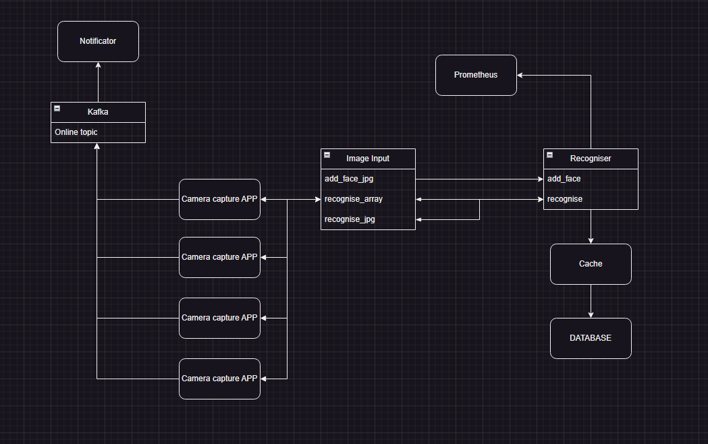

### Face recognition system.

Work scheme:


Your need to apply migrations to database:

```shell
alembic upgrade head
```

Then add faces to database in jpg by add_face_jpg method in API

When camera capture app is running it sends images to image input app.
Answers are stored in Kafka and streamed by notificator app.
